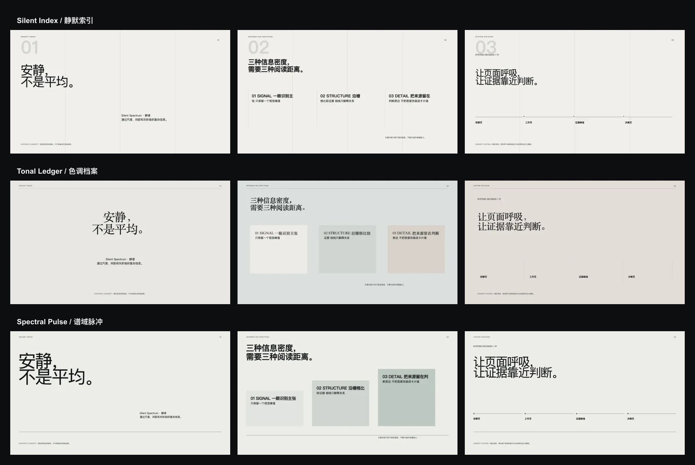
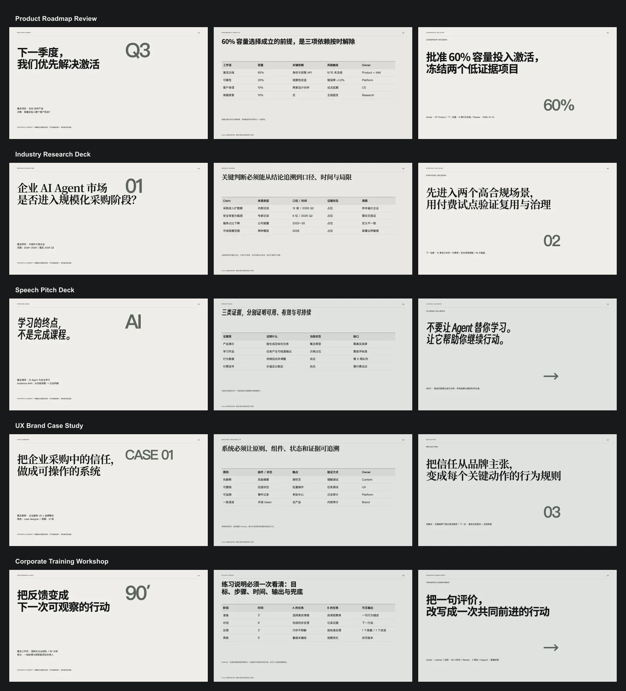

# Silent Spectrum · 静谱 — selected synthesis 0.3.0 release

Silent Spectrum is a shared visual mother system for five presentation scenarios.
It turns information density into a controlled spectrum of scale, spacing,
tone, and semantic linework. The selected synthesis is now released for the
self-contained web runtime.

## Current boundary

- Language: Chinese-first.
- Delivery: self-contained web deck templates; native PPTX remains a separate
  renderer-dependent projection.
- Evidence: the five gallery examples are explicitly synthetic theme-preview
  content; illustrative values cannot be reused as real project evidence.
- Imagery: vector and typographic expression is preferred in this exploration;
  no user reference image is redistributed.
- Approval: Allen Xie selected `spectral-pulse` as the primary direction and
  mixed in the strict alignment discipline of `silent-index`.

## Scenario expressions

- Product Roadmap: outcome → opportunity evidence → choices → sequence and
  dependencies → explicit leadership decision.
- Industry Research: decision and scope → source ledger → sizing and structure →
  scenarios → strategic action.
- Speech Pitch: hook → tension → proposition → mechanism and proof → objection →
  future state → ask and callback.
- UX Brand Case: challenge and role → evidence → insight → iteration → system and
  application → outcome boundary and reflection.
- Corporate Training: performance need → observable outcome → model and example →
  practice and feedback → assessment → transfer commitment.

The five complete templates total 48 slides. Each is available as a canonical IR
under `../../ir/*--silent-spectrum.yaml`, with full-deck contact sheets under
`family-previews/`.
