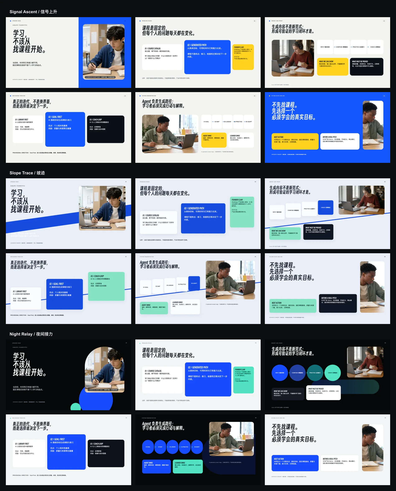

# AhaSlope · Speech Pitch Deck 0.4.0 theme study

This is the controlled Allen FRAME record behind Speech Pitch Deck 0.4.0. All
three routes used the same six representative slides, source images, concept
facts, and evidence gaps. Slope Trace is the released default; Night Relay is
the released high-contrast alternative. Signal Ascent remains an unpublished
comparison route.



## Normalized brief

- Scenario: live founder pitch for investors, business experts, and entrepreneurs.
- Desired belief shift: from “courses are fixed catalogs” to “AI can compose a
  goal-specific learning path that remains accountable to practice and transfer.”
- Desired next action: agree to a bounded comparative pilot using one real
  learning objective and a pre-agreed evidence plan.
- Full-deck target after route selection: ten slides, self-contained HTML and a
  native editable PPTX projection when a compatible renderer is available.
- Language: Chinese-first; short Latin labels only where they improve scanning.
- Font: Smiley Sans 2.0.1 for short display text, redistributed under SIL OFL
  1.1. Body text remains in an open-source CJK sans category with system fallbacks.

## Concept project dossier

The user supplied the product name, founder role, audience, venue, page count,
and central proposition. No verified product, user, market, traction, team,
timeline, or outcome evidence was supplied. This exploration therefore treats
AhaSlope as a **synthetic concept project**.

- Concept users: international teenagers and young adults with specific,
  time-bounded learning goals who need practice and application, not another
  course catalog.
- Concept mechanism: goal → diagnostic map → generated lesson → active practice
  → check and adapt.
- Evidence currently available: the user-authored proposition and three disclosed
  AI-generated context images. The images are a multinational learner anthology,
  not real AhaSlope users or a longitudinal study.
- Missing before a real pitch: product demo, course-quality rubric, safety and
  source policy, learning transfer measure, baseline, pilot cohort, business
  model, market definition, team facts, and explicit investment or partnership ask.
- Disclosure: no slide in this study represents a real user, measured effect,
  customer quote, shipped interface, or commercial result.

## Narrative translation

The supplied UX-style path is retained as an evidence layer, but the live talk
uses the Speech Pitch sequence:

1. Hook: learning should not begin with searching a catalog.
2. Stakes and role: personal goals move faster than fixed courses.
3. Insight and proof boundary: a generated path is only credible when evidence
   and validation responsibilities are explicit.
4. Mechanism alternatives: compare three structurally different ways to compose
   learning rather than presenting one polished answer as inevitable.
5. System demonstration: show the goal-to-transfer loop.
6. Future and ask: propose one bounded comparative pilot, then return to the hook.

When producing a full ten-slide deck, keep Slope Trace as the default and offer
Night Relay when the venue benefits from stronger dark-stage peaks. The bundled
six-slide AhaSlope concept remains a controlled representative sample; it is not
a claim that a real product, customer, pilot, native PPTX, or business result exists.

## Rebuild and validate

```bash
node scripts/build-presentation-direction-board.mjs \
  skills/speech-pitch-deck/assets/explorations/ahaslope-0.4.0

node scripts/validate-presentation-direction-exploration.mjs \
  skills/speech-pitch-deck/assets/explorations/ahaslope-0.4.0
```
