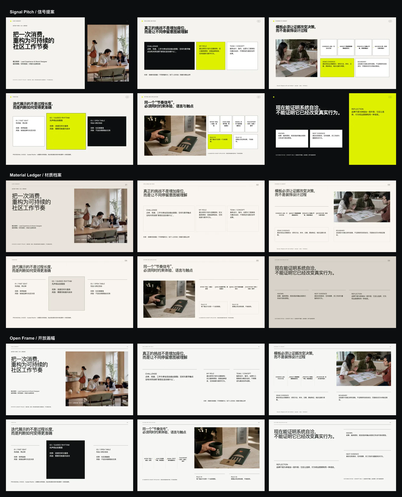

# Aster Yard 0.4.0 direction study

Status: release provenance for the three approved UX Brand Case Study 0.4.0
themes. Allen Xie requested publication on 2026-08-31. Material Ledger is the
default; Signal Pitch and Open Frame are approved alternatives.

The same disclosed synthetic UX + brand case, six narrative frames, three image
assets, 1920 × 1080 canvas, evidence boundary, and text content are used across
all routes. The comparison therefore tests design direction instead of content
quality.



## Fixed storyline

Challenge and role → evidence → insight → iteration → system and application →
outcome and reflection.

The six rendered frames are case summary, challenge and role, evidence to
insight, iteration, system and application, and outcome and reflection.

## Reference-principle extraction

- Reference 1 contributes high contrast, oversized hierarchy, modular
  sequencing, and restrained acid color. It does not authorize copying its card
  shapes, proposal content, imagery, or brand.
- References 2 and 3 contribute numbering, hairline rules, warm paper behavior,
  controlled materiality, and the idea that applications should demonstrate a
  system. Their marks, Cafe28 identity, logo layouts, and manual pages are not
  reused.
- References 4 and 5 contribute image-led pacing, architectural whitespace,
  simple sans-serif hierarchy, and variation between wide image and text-led
  pages. Their portfolio order, photographs, and signature compositions are not
  reproduced.

## Direction classification

1. **Signal Pitch / 信号提案** — the clarity baseline. Commercial, graphic,
   high-contrast, and fastest to read in a room.
2. **Material Ledger / 材质档案** — the context translation. Tactile, archival,
   and strongest for brand-system provenance and craft.
3. **Open Frame / 开放画幅** — the authored leap. Image-led, spacious, and
   strongest for portfolio interviews and human context.

These routes differ in grid, typography, image behavior, rhythm, and material
color—not only palette. Their release status is recorded in the formal theme
packs under `references/themes/`; this directory preserves the controlled FRAME
comparison, synthetic assets, reviews, and source boundaries.

## Rhythm revision after visual review

The second rendered pass applies the user's editorial-rhythm feedback rather
than treating every slide as equally full:

- covers and closings are quiet, high-scale frames;
- evidence and system pages carry the highest working density;
- challenge and iteration pages use one oversized assertion or selected option
  as a clear peak;
- labels, sequence numbers, decisions, and first lines have distinct scale roles
  instead of behaving like uniform body copy;
- Signal Pitch uses borderless rounded color masses; Material Ledger retains
  evidence-bearing hairlines; Open Frame reserves long rules for structure.

The rounded Signal Pitch blocks transfer the reference principle of soft,
fashion-forward color fields. They do not reproduce the reference card count,
content, proportions, or black-line graphic.

## Honest evidence boundary

Aster Yard is a synthetic concept project. The research scene, findings,
collaboration roles, applications, and outcome language demonstrate template
behavior only. The deck explicitly states that there is no real user data,
business result, client approval, or award.

## Rebuild and validate

Use the bundled Codex Node runtime packages through `NODE_PATH`, then run:

```bash
node scripts/validate-presentation-direction-exploration.mjs \
  skills/ux-brand-case-study/assets/explorations/aster-yard-0.4.0

node scripts/build-presentation-direction-board.mjs \
  skills/ux-brand-case-study/assets/explorations/aster-yard-0.4.0
```

The validator renders each route in Chromium and checks all 18 frames for DOM
bounds, text overflow, image size, alternative text, authored crop position,
and concept disclosure.

## Release decision

Material Ledger is the scenario default because it received the strongest
evidence, craft, and rhythm review. Signal Pitch and Open Frame remain separately
selectable formal themes rather than being merged into one universal skin.
